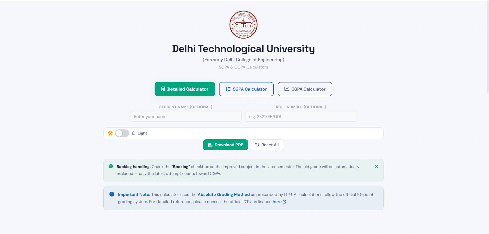
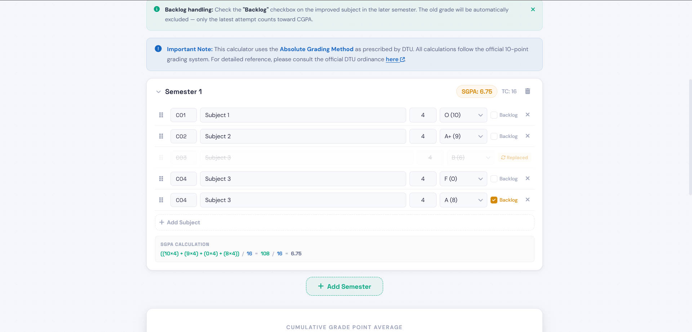

## 📊 DTU GPA & CGPA Calculator

A modern and user-friendly web application designed to calculate SGPA and CGPA for students following the DTU (Delhi Technological University) grading system.

This tool simplifies academic performance tracking by allowing users to input subject details, credits, and grades across multiple semesters. It supports backlog handling and ensures accurate CGPA calculation based on the latest valid attempt.

---

## 🚀 Features

* SGPA and CGPA calculation based on DTU absolute grading system
* Multi-semester support with dynamic input
* Backlog handling (latest attempt considered)
* Clean and modern user interface
* PDF export of result summary
* Light/Dark mode toggle
* Instant calculation with real-time updates

---

## 🛠️ Tech Stack

* HTML
* CSS
* JavaScript

---

## 📸 Screenshots

### Main UI

### Calculator

### Result

---

## ⚙️ How to Use

1. Select the calculator mode (SGPA / CGPA / Detailed)
2. Enter subject details and credits
3. Assign grades based on DTU grading system
4. Add multiple semesters if required
5. View results instantly or download as PDF

---

## 📌 Note

This calculator follows the DTU absolute grading system. The CGPA is calculated considering only the latest valid grades, excluding replaced backlog attempts.

---

